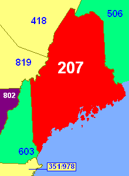

Things that are three digits? 
* HTTP response headers.  
* Area codes.

The site that no one needed:

# HTTP Area Codes

|Area Code | Image | Description|
|---|---|---|
|201|  | **Created**: North Jersey|
|202|  | **Accepted**: Washington DC|
|203|  | **Non-Authoritative Information**: Western Connecticut|
|204|  | **No Content**: Manitoba|
|205|  | **Reset Content**: Alabama|
|206|  | **Partial Content**: Seattle, WA|
|207|  | **Multi Status**: Maine|
|208|  | **Already Reported**: Idaho|
|301|  | **Moved Permanently**: Western Maryland|
|302|  | **Found**: Delaware|
|303|  | **See Other**: Colorado|
|304|  | **Not Modified**: West Virginia|
|305|  | **Use Proxy**: Miami, FL|
|307|  | **Temporary Redirect**: Wyoming|
|308|  | **Permanent Redirect**: Western Nebraska|
|402| | **Payment Required**: Eastern Nebraska|
|403  | | **Forbidden**: Southern Alberta|
| 404| | **Not Found** Atlanta, GA|
|405 | |**Method Not Allowed** Central Oklahoma |
|406 | |**Not Acceptable** Montana |
|407 | |**Proxy Authentication Required** Eastern Florida |
|408 | |**Request Timeout** California Bay Area |
|409 | |**Conflict** Eastern Texas |
|410 | |**Gone** Eastern Maryland |
|411 | |**Length Required** Directory Assistance |
|412 | |**Precondition Failed** Pittsburgh |
|413 | |**Payload Length Too Large** Western Massachusetts |
|414 | |**Request-URI Too Long** Milwaukee, WI |
|415 | |**Unsupported Media Type** San Francisco, CA|
|416 | |**Request Range Not Satisfiable** Toronto, ON|
|417 | |**Expectation Failed** SW Missouri|
|418 | |**I am a teapot** Quebec, QC|
|501 | |**Not Implemented** Little Rock, AK|
|502 | |**Bad Gateway** Louisville, KY|
|503 | |**Service Unavailable** Portland, OR|
|504| |**Gateway Timeout** New Orleans, LA|
|507| |**Insufficient Storage** Southern Minnesota|
|509| |**Bandwidth limit Exceeded** Eastern Washington|

|Other Interesting numbers | Image | Description|
|---|---|---|
|443 | |**HTTPS** Maryland |

All images are public domain or creative commons images.